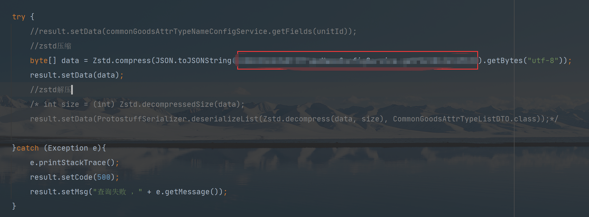
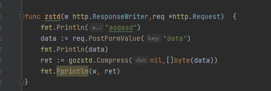
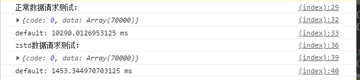
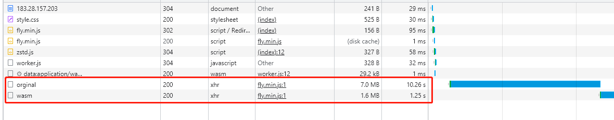

<div align="center">
<h1>wasm-zstd</h1>
<p>
  <strong>Big data transmission solution based on Webassembly</strong>
  <br /><br />
  <strong>基于Webassembly的大数据传输解决方案</strong>
</p>
<p>
  <sub>Made with ❤︎ by
    <a href="https://github.com/JousenZhou">JousenZhou</a>
  </sub>
</p>
<p>
<a href="https://github.com/JousenZhou/wasm-zstd"></a>
<a href="https://github.com/JousenZhou"></a>
</div>


### Usage 
开发，构建和运行。ps: ( ！！！) 需要启动go服务

```bash
# 获取远程仓库代码
git clone https://github.com/JousenZhou/wasm-zstd
# 进入目录
cd wasm-zstd
# 解压go服务端[命令不行手动解压吧]
unrar e ./GoServer/GoServer.rar ./GoServer
# 打开执行Go服务.exe
./GoServer/GoServer.exe
# 安装依赖
yarn
# 启动项目
yarn devstart
# 在浏览器访问 http://localhost:3000
```

### 基本思路与探讨

服务端发送数据前用zstd将数据进行一次压缩，代替服务端可配置的gzip压缩。zstd是近几年谷歌新推出的压缩算法拥有不错的压缩率|压缩时间，相较于gzip有约近5~10倍提升。由于压缩后得到是Uint8Array数组结果集，所以前端需要对这份数据进行解压。前端如果在javeScrtpt层进行解压效率会很低，因为javeScript运行会转成c++再编译，在这转换过程性能会大量损耗。因此Webassembly技术将可解决这个难题。


### 多线程挂载wasm模块 + 数据解压 

```js
// zstd-wasm base64编码
let wasm = 'xxx'
let heap,instance;
const IMPORT_OBJECT = {
    env: {
        emscripten_notify_memory_growth: function() {
            heap = new Uint8Array(instance.exports.memory.buffer);
        }
    }
};
function loadWebAssembly(path, imports = {}) {
    return fetch(path) 
        .then((response) => response.arrayBuffer())
        .then((arrayBuffer) => WebAssembly.instantiate(arrayBuffer, IMPORT_OBJECT))
        .then((result => {
            instance = result.instance;
            IMPORT_OBJECT.env.emscripten_notify_memory_growth(0);
        }))
}
loadWebAssembly('data:application/wasm;base64,' + wasm).then();

onmessage = function(evt){
    let array = new Uint8Array(evt.data);
    const compressedSize = array.byteLength;
    const compressedPtr = instance.exports.malloc(compressedSize);
    let heap = new Uint8Array(instance.exports.memory.buffer);
    heap.set(array, compressedPtr);
    let uncompressedSize = Number(instance.exports.ZSTD_findDecompressedSize(compressedPtr, compressedSize));
    const uncompressedPtr = instance.exports.malloc(uncompressedSize);
    const actualSize = instance.exports.ZSTD_decompress(uncompressedPtr, uncompressedSize, compressedPtr, compressedSize);
    const dec = heap.slice(uncompressedPtr, uncompressedPtr + actualSize);
    instance.exports.free(compressedPtr);
    instance.exports.free(uncompressedPtr);
    postMessage(JSON.parse(new TextDecoder().decode(dec)))
};
```

### 服务端压缩数据简易代码
Java:
<p></p>
Go:
<p></p>

### 测试结果
ps:不要在本地测试没意义;

外网测试：
<div>


</div>

